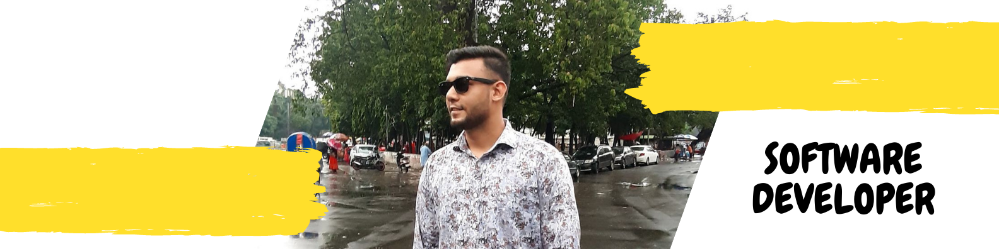

  <kbd>
 </img>
  </kbd>

<h1 align="center">Hi 👋, I'm Sohanur Rahman Shanto</h1>

A passionate self-taught Software Engineer from Bangladesh. My passion for software lies with dreaming up ideas and making them come true with elegant interfaces. I take great care in the experience, architecture, and code quality of the things I build. I am also an open-source enthusiast and maintainer. I learned a lot from the open-source community and I love how collaboration and knowledge sharing happened through open-source.

 

  

  

  
  

 

- 🌱 I’m currently learning **Python frameworks and DevOps technology.**

- 👯 I’m looking to collaborate on **anything free and open source.**

- 💬 Ask me about **anything related to python and machine learning, I am happy to help you.**

- 📫 How to reach me **sohanurshantorahman@gmail.com**

- ⚡ Fun fact **I love functional programming, complex algorithms and tea.**

</a>

   

## My Skill Set  

<table><tr><td valign="top" width="33%">

### Frontend  

  

  
  
  
  
  
     

</td><td valign="top" width="33%">

### Backend  

  

  
  
  
  
  
  
  
  

</td><td valign="top" width="33%">

### DevOps  

  
  
  
  
  
  
  

</td></tr></table>  

   

&nbsp;

